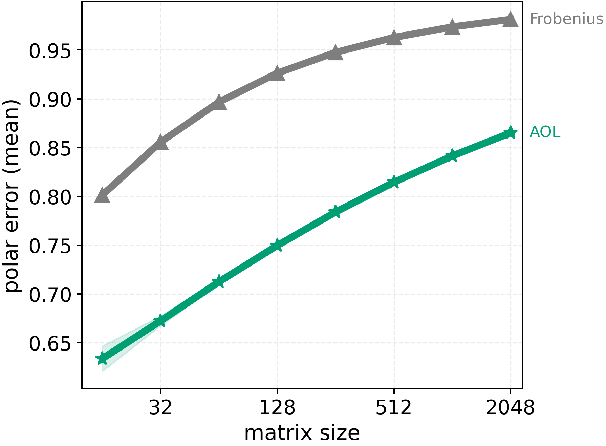
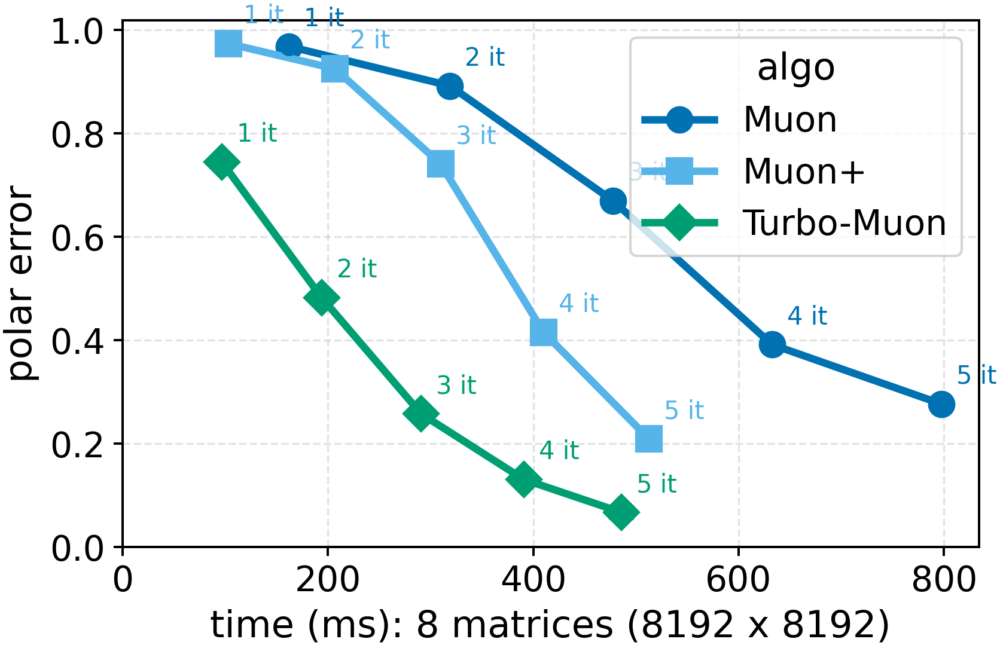

# Turbocharging Newton-Schulz with AOL Rescaling and Triton Kernels

> Code for the paper: "Turbo-Muon: Accelerating Orthogonality-Based Optimization with Pre-Conditioning"

TLDR: Orthogonality improving gradient preconditioning allows the removal of one costly Newton-Schulz iteration.

## Standalone code

In this repository, we provide the following standalone implementations:
- A custom triton implementation of the Newton-Schulz iterative steps (in `newton_schulz_triton.py`).
- An AOL preconditioned version of the Muon optimizer in the `torch.optim` format (in `turbo_muon_torch.py`).
- An AOL preconditioned version of the Muon optimizer in the `optax` format (in `turbo_muon_optax.py`).

If needed the newton schulz routines can be used independently with the `kernel` library:
```python
from kernels import get_kernel                                                               
kern = get_kernel("tboissin/newton_schulz_triton")                                           
newton_schulz = torch.compile(kern.newton_schulz) # optionally compile with torch.compile    
```

## Changes

For the triton kernel implementation we started from the [implementation of newton schulz shipped aside the dion optimizer](https://github.com/microsoft/dion)
which has a great triton implementation of the newton schulz algorithm.

### Fewer iterations:

We remove the previous normalization to switch to AOL rescaling
Which is further explained in the paper: https://arxiv.org/pdf/2208.03160

This consists in computing W@W^t using ns_line_1 and then computing the
scaling factors: fast_inv_sqrt(reduce_sum(abs(WW^t), axis=-1)) which is a vector

Since the main operation to compute those correspond to ns_line_1,
we can fuse it with the first newton schulz iterate. Furthermore this gives a better
starting point for the newton schulz iterations as the matrix is closer to orthogonal

Thanks to this, we can save one iteration of newton schulz. 

### triton kernel for ns_line_3:

We noticed that the ns_line_3 function was taking a lot of time, so we wrote a triton kernel to avoid multiple
loadings of the same data. This give a marginal speedup on small matrices, where loading data is the bottleneck.

### Empirical validation:

In order to validate the suitability of this approach for orthogonality based optimizers, we run benchmarks 
on both the nanogpt and cifar speedrun setups, as implemented in `speedrun-nanogpt` and `speedrun-cifar` directories
respectively.

## Current results:

We can start by comparing pre-conditioning methods: AOL consistently
outperforms the usual Frobenius normalization. When matrices
get larger.



In practice, preconditioning is effective: Applying AOL before
the algorithm improves convergence speed, especially for large matrices. In
this context, an iteration can be removed while still achieving an improved
convergence.


Building atop Muon+, which includes Triton
kernels and dynamic polynomial parameters (1.7x faster), our approach adds
an extra Triton kernel that unlocks moderate gains (2.2x faster). Finally,
removing one iteration out of 5 also improves runtime (2.8x faster).


This ultimately leads to a better compromise between polar error and runtime.



### Drop in in nanogpt speedrun

We trained a 144M GPT model on the FineWeb dataset up to the performance
of GPT-2 and reported validation loss. We reused the fastest existing training
script and replaced the Newton-Schulz implementation without changing any
other parameters. Each line compared Turbo-Muon with baselines that have
one extra iteration:

| Turbo-Muon         | Muon+              | Muon               |
| ------------------ | ------------------ | ------------------ |
| 3.35 ± 0.002 (1it) | 3.35 ± 0.003 (2it) | 3.34 ± 0.002 (2it) |
| 3.32 ± 0.001 (2it) | 3.31 ± 0.002 (3it) | 3.30 ± 0.002 (3it) |
| 3.29 ± 0.001 (3it) | 3.29 ± 0.003 (4it) | 3.29 ± 0.005 (4it) |
| 3.28 ± 0.001 (4it) | 3.28 ± 0.003 (5it) | 3.28 ± 0.001 (5it) |


### Drop in in cifar speedrun

On the cifar speedrun setup, we obtain similar final accuracies:

| Model / Run | Mean Accuracy | Std Dev | Training Time Mean (s) | Iterations |
| --- | --- | --- | --- | --- |
| NS  | 0.9401 | 0.0009 | 2.66 | 20 |
| AOL + NS | 0.9401 | 0.0016 | 2.64 | 20 |

This minor speedup is expected as the model is small, however, it does validate the equal capability of our approach to optimize
the model (even with fewer epochs). Also, we did not modify any hyperparameter from the baseline NS run to replicate this result.

## Citation

```
@misc{2025flashnewtonschulz,
  author       = {Thibaut Boissin and Thomas Massena},
  title        = {flash-newton-schulz: AOL rescaling and triton kernel for newton schulz},
  year         = {2025},
  url          = {https://github.com/thib-s/flash-newton-schulz}
}
```
